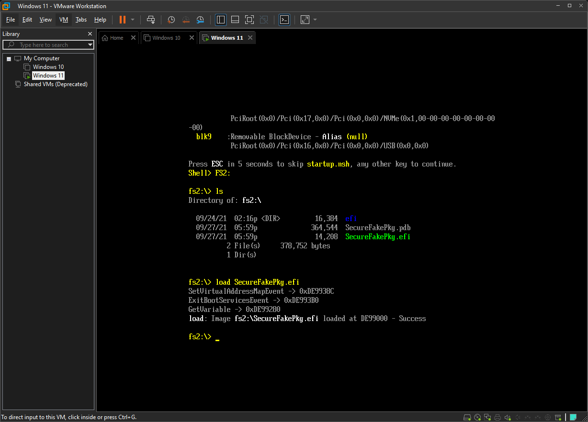
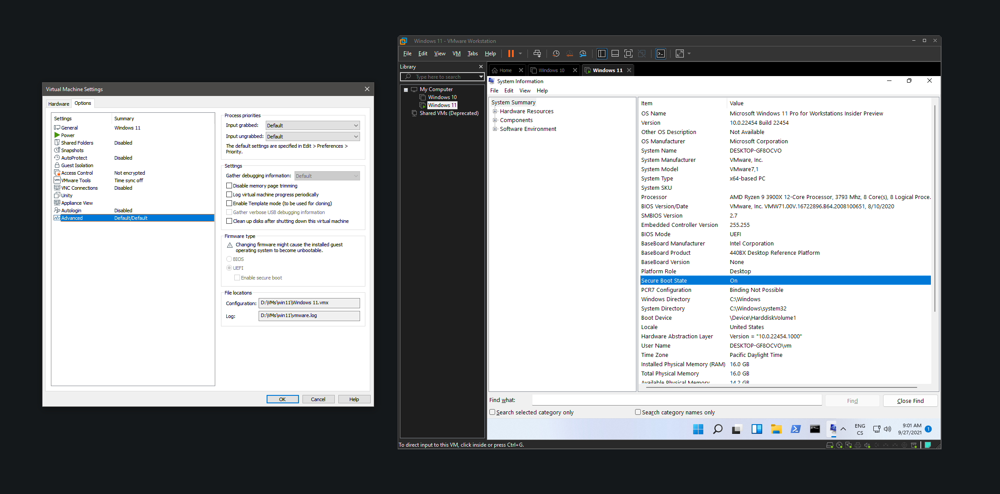

# SecureFakePkg
SecureFakePkg is a simple EFI runtime driver that hooks GetVariable function and returns data expected by Windows to make it think that it's running with secure boot enabled. In other words, it fakes secure boot status.

**Please note:** Before loading the driver, check that you have vendor (Microsoft) keys enrolled. If not, try enabling secure boot and then disabling it. You can check that they are enrolled with *dmpstore -b* command in EFI shell. You should see [something like this](assets/keys.png).




## Usage
In order to use SecureFakePkg, you need to load it. First, obtain a copy of SecureFakePkg.efi and a copy of [EDK2 efi shell](https://github.com/tianocore/edk2/releases). Now follow these steps:

1. Extract downloaded efi shell and rename file Shell.efi (should be in folder UefiShell/X64) to bootx64.efi
2. Format some USB drive to FAT32
3. Create following folder structure:
```
USB:.
 │   SecureFakePkg.efi
 │
 └───EFI
      └───Boot
              bootx64.efi
```
4. Boot from the USB drive
5. An UEFI shell should start, change directory to your USB (FS0 should be the USB since we are booting from it) and list files:
```
FS0:
ls
```
6. You should see file SecureFakePkg.efi, if you do, load it:
```
load SecureFakePkg.efi
```
7. Now you should see output from SecureFakePkg. If it was successful, exit and boot into Windows (change to Windows boot media - usually FS1 - and run \EFI\Boot\bootx64.efi)

## Compiling
See [VisualEfi](https://github.com/ionescu007/VisualUefi).

## Download
See [UnknownCheats post for compiled version](https://www.unknowncheats.me/forum/anti-cheat-bypass/471614-securefakepkg-trick-windows-thinking-secure-boot.html).
